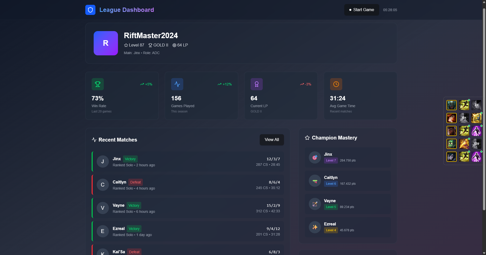
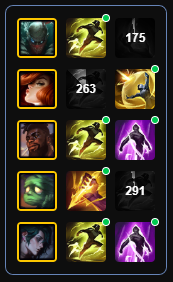

# ⚡ Lightning - League of Legends Companion

> A clean, ad-free League of Legends companion app built with modern web technologies and native performance.

> **🚧 Early Development Notice:** This project is in active development. Core features are being implemented and the app is not yet ready for general use. Star the repo to follow progress!

**Dashboard Mockup**

**Summoner Spell Tracking Overlay**

<!-- Add actual screenshots when available -->

## ✨ Features

### ✅ Completed Features

- **🚫 Ad-Free Experience** – Focus on gameplay, not distractions  
- **⚡ Native Performance** – Built with Tauri for lightning-fast responsiveness  
- **🏗️ Modern Tech Stack** – React 19 with Compiler optimizations  
- **🔐 Secure API Integration** – Riot Games API access through secure proxy and per client secret and rate limits   
- **⏱️ Live Summoner Spell Tracking** – Real-time cooldown monitoring during matches  
- **📊 Match History Integration** – Pulls detailed match history from Riot API  
- **🏅 Champion Mastery Display** – Shows mastery levels and points for champions  

### 🚧 In Development

- **🎯 Comprehensive Dashboard**
  - Advanced performance analytics _(in progress)_
  - Win rate analysis across different time periods _(planned)_
  - Advanced gameplay statistics and trends _(planned)_

---

## 📊 Feature Status

| Feature                          | Status       |
|----------------------------------|--------------|
| Ad-Free Experience               | ✅ Completed |
| Native Performance (Tauri)       | ✅ Completed |
| Secure Riot API Integration      | ✅ Completed |
| Live Summoner Spell Tracking     | ✅ Completed |
| Match History Integration        | ✅ Completed |
| Champion Mastery Display         | ✅ Completed |
| Win Rate Analytics               | 🚧 Planned   |
| Advanced Gameplay Insights       | 🚧 Planned   |
| Team Composition Analysis        | 🚧 Future    |
| macOS Release                    | 🚧 Future    |

---

## 🗺️ Roadmap

### 🔄 Current Focus
- [x] Core dashboard implementation  
- [x] Match history integration with Riot API  
- [x] Basic champion mastery display  

### 🎯 Upcoming Features
- [ ] Real-time match statistics  
- [ ] Win rate analytics and trends  
- [ ] Advanced gameplay insights  

### 🚀 Future Plans
- [ ] macOS release  
- [ ] Team composition analysis  
- [ ] Build recommendations
